# Vizsgatételsor 2017.
1. Bioelektromos jelek osztályozása, vizsgálómódszerek
2. A biopotenciál elvezető elektródok jellemző tulajdonságai (impedancia, frekvencia átvitel)
3. Fém elektródok jellemzői, az elektród potenciál fogalma és jelentősége
4. A sejtaktivitás befolyásolása iontoforézissel
5. A membránpotenciál létrejöttéért felelős folyamatok
6. Az akciós potenciál létrejöttéért felelős folyamatok
7. Az intracelluláris elvezetési módszerek
8. Extracelluláris mikroelektród elvezetés, sejtazonosítás
9. A biológiai előerősítők jellemző tulajdonságai
10. Stereotaxiás módszer
11. Az EEG elvezetés technikája
12. EEG elvezetésnél jelentkező zavarok
13. Az EEG jellemző összetevői, kóros EEG jelek
14. Eseményhez-kötött potenciálok (exogén, endogén komponensek)
15. EEG-ERP számítógépes analízisének főbb módszerei
16. EEG genezis, bioelektromos mezők típusai
17. ERP forrás-analízis jelentősége
18. „Steady state” válasz, klinikai alkalmazása
19. Magnetoenkefalográfia
20. Elektromiográfia
21. EKG elvezetések típusai, az EKG görbe jellemzői
22. Az EKG kóros eltérései

# 1. Bioelektromos jelek osztályozása, vizsgálómódszerek
## Osztályozás
### Nagyságrend szerint:
  - Micro
    - Membrán potenciál (MP)
    - Akciós potenciál  (AP)
    - Idegsejt aktivitás
      - intra/extra/multi- unit aktivitás (I/E/M - UA)

  - Macro
    - Neurogram (Electro - NG)
    - Retinogram (ERG)
    - Enkefalogram (EEG)
    - Kortikogram (ECoG)
    - Magnetoenkefalogram (MEG)
    - Event-related Potential (ERP)
      - Evoked Potential (EP)
      - Visual EP
      - Auditory EP
      - Somatosensory EP

  - Határon: Local Field Potential (LFP)

### Mérés helye szerint
  - --agy-- Kortiko-, Enkefalo-
  - --szív-- Cardiac-
  - --egyéb izom-- Myo-

## Vizsgálómódszerek
  - --ElektroOkulokGram-- (EOG):

A szem elektromosan töltött gömb, pozitív pólusa elöl, negatív hátul van.
Szemmozgáskor ez az elektromos dipól iránya változik, a szem köré helyezett
elektródokkal potenciálváltozásként elvezethető.

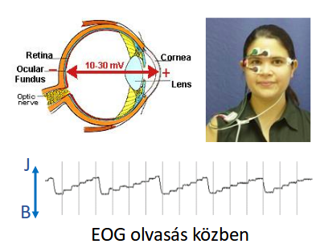
  - --Pszichofiziológia--:

  Pszichológiai folyamatokhoz társuló elektrofiziológiai változókat vizsgálja.

    - Független változó: pszichológiai,
    - Függő változó: fiziológiai

    - Szisztémás pszichofiziológia:
      - központi idegrendszeri változók
      - szív - érrendszeri változók

    - Tematikus pszichofiziológia:
      - kognitiv-
      - fejlődés-
      - szociál-
      - klinikai-

# 2. A biopotenciál elvezető elektródok jellemző tulajdonságai (impedancia, frekvencia átvitel)

## Alapfogalmak

  - **Elsőfajú vezető / elektronvezető**: az az anyag ahol az elektron elmozdulása hozza létra az elektromos áramot.
  - **Másodfajú vezető / ionvezerő**: olyan anyag ill. oldat, ahol töltéssel bíró részecskék (ionok) elmozdulása hozza létra az áramot.
  - **Elektród: Szűkebb értelemben egy eletronvezető, tágabb értelemben egy elektronvezető és egy elektrolit együttese.
  - **Elektród potenciál**: Az elektronok potenciális energiája az elektródon (elvi definíció, mivel ennek abszolút értéke nem határozható meg)
  A valóságban olyan relatív érték, melyet egy önkényesen kiszemelt Föld-ponthoz, a standard hidrogénelektród potenciáljához viszonyítunk: annaka galvánelemnek az elektromos ereje, amelynek egyik elektródja a vizsgált, a másik a standard hidrogénelektród.
  - **Nempolározódó elektród**: Az elektródreakcióban résztvevő fém saját sójával érintkezik és a só anionját tartalmazó oldatba merül. Pl: ezüst/ezüstklorid, AgCl + e <-> Ag + Cl(-)

## Biopotenciál elvezetés
*Kapcsolat élő és élettelen rendszer között*
mérő elektródok - biológiai rendszer

**Mindig két elektród közötti potenciál-különbséget mérünk**

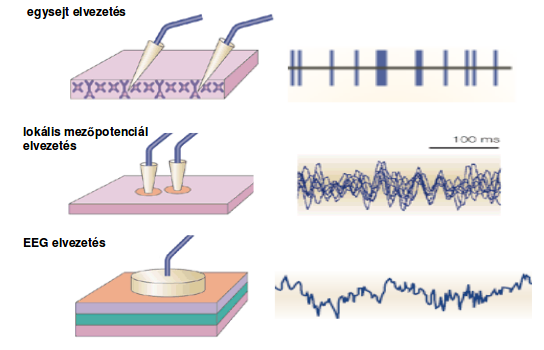
  - MINDIG 1 FÖLD
  - Monopoláris: 1 indifferens (referens), a többi aktív (csak egy elektród van aktív szövetben/-en a másik, indifferens/0 potenciálú helyen van)
  - Bipoláris: Ami az egyiknek referens a másiknak aktív (mindkét elektród aktív felületen van, vagy a szövetben helyezkedik el)
  - Közös átlag indifferens: külön aktív elektródok, egy indifferenssel összekötve egy-egy nagy ellenálláson keresztül.
  - Forrás átlag indifferens elvezetés: hasonló az előzőhöz de több indifferens van

## Elektród típusok (Agyi bioelektromos jelekhez)
  ***Ideális elektród nincs***
  - Intracelluláris mikroelvezetés:
    - üvegkapilláris mikroelektród (patch-clamp elektród)
      - Kis elektróda ellenállás
      - Nagy szigetelési ellenállás (5 GOhm)
      - hegy < 1 um
    - Sharp microelectrode
      - Nagy elektróda ellenállás
      - Szivárgó áram, kis szigetelő ellenállás (50-100 MOhm)
      - hegy (0.06-0.3 um) << 1 um
    - - Technikailag bonyolultabb
    - + Nagy  jel amplitúdója (1-100 mV)
    - - Kevés csatornán (1-4) lehet elvezetni
    - - Szabadon mozgó állatokban nem használható
    - + Sejten belüli folyamatot közvetlenül méri

  - Extracelluláris mikroelvezetés:
    - üvegkapilláris mikroelektród
    - hegyezett fém elektród, lakk szigetelés
    - hegyezett fém elektród, üveg szigetelés
    - szénszál, üveg kapilláris szigetelés
    - szigetelt vékony fémhuzal (fine wire electrode)
    - tetród
    - multielektród
    - + Technikailag egyszerűbb
    - - Alacsony jel amplitdúdó (10-500 uV)
    - - Kis elektromos zajú erősítők kellenek
    - + Sok csatornán (10-200) lehet elvezetni
    - + Szabadon mozgó állatokban is használható
    - - Sejten belüli folyamatokat közvetlenül nem méri
  - Lokális mezőpotenciál elvezetés (LocalFieldPotential - LFP):
    - Fentiek bármelyike
  - Makropotenciál elvezetés:
    - Felszíni elvezetés:
      - fém korong elektród
      - Ag/AgCl elektród
    - Intracerebelláris/muszkuláris:
      - szigetelt fémhuzal elektród
      - multielektród
      - tű elektród

## Tartományok
  - Scalp - 2-10mm - 10-200 uV
  - Epidural - 1-3mm - 0.1-4 mV
  - Surface (Brain) - 1-3 mm - 0.2-5 mV
  - Extracellular - 1-50 um - 0.4-20 mV
  - Intracellular - 0.5-3 um - 1-100 mV
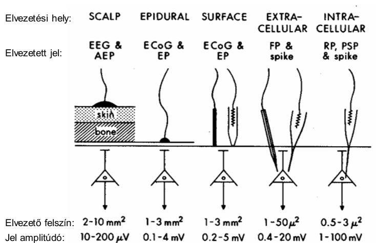

## Elektródok általános tulajdonságai
  1. Elektród impedancia
  2. Elektród potenciál
  3. Elektród stabilitás, biokompatibilitás

  ***NEMZETKÖZI EEG SZABVÁNY*** Az elektród ellenállása kevesebb legyen mint 5 kOhm

  Nagyságrendi adatok:
  - **Ellenállás**
    - Réz: 1.7 uOhm cm
    - [3M] KCl: 5 Ohm cm
    - Tengervíz: 22 Ohm cm
    - Fiziológiás oldat: 70 Ohm cm
    - Csapvíz: 0.2-10 Ohm cm
    - Desztillált víz: 1-5 MOhm cm
  - **Neuron**
    - R-membrán: 10-100 kOhm cm^2
    - R-20 um átmérőjű neuron: ~200 MOhm
    - C-memberán: 1 uF/cm^2
    - C-20 um átmérőjű neuron: ~50 pF
    - R-intracelluláris térben: 50-200 Ohm cm
  - **Mikroelektród**
    - SHARP - Alacsony szigetelési ellenállás (50-100 MOhm) - szivárgási áram
    - Patch-Clamp (negatív nyomás után) - Nagy szigetelési ellenállás (50 GOhm)

## Elektród impedancia helyettesítő áramköre
*Elektród bemenő impedanciája méretétől és anyagától függ*

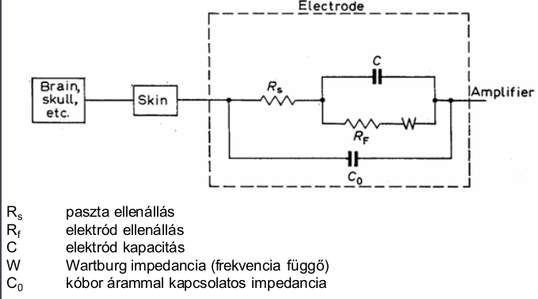

## Bipoláris elvezetés helyettesítő áramköre

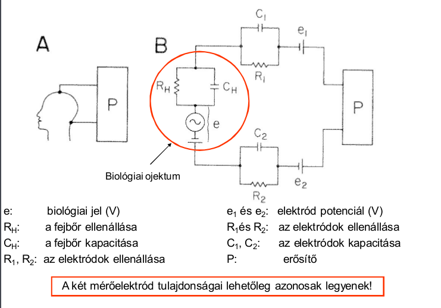

A két mérőelektród tulajdonságai lehetőleg azonosak legyenek!

## Mikroelektród elvezetés helyettesítő áramköre

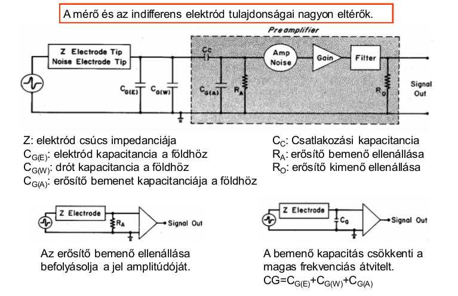

## Elektrokémiai feszültségsor

***Fém-folyadék-fém kapcsolat esetén az elektrokémiai feszültségsornak megfelelő galvánelem képződik.***
  - Elektrokémiai feszültségsor: Fémelektróda és fémsó oldat közötti feszültség egy különleges elrendezésben mérhető. E célre úgynevezett hidrogénelektródát használnak, ehhez rendelik a 0 V vonatkoztatási potenciált.
  A táblázatban a fémek szabványosan mért feszültségértékei láthatóak.
  Az elektrokémiai feszültségsor segítségével különböző elektróda-anyag kombinációk várható feszültsége határozható meg.
  **Azokat a fémeket, amelyek a hidrogénhez képest pozitív feszültségűek, nemesfémeknek, míg a többieket nem-nemes (másnéven közönséges) fémeknek nevezzük.**
  Két fém összehasonlításakor a feszültségsorban nagyobb értékkel rendelkező fémet a másiknál "nemesebbnek" hívjuk.
  - PL: nemes - Arany, közönséges-Magnézium

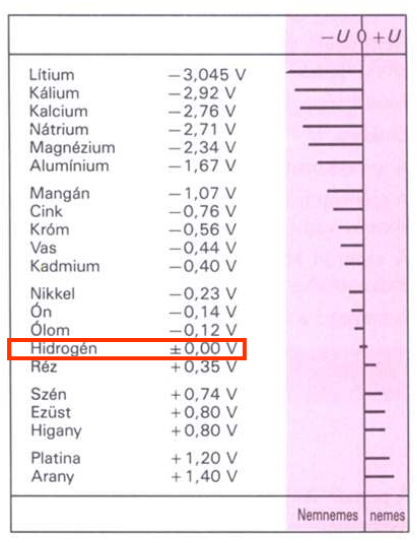

## Rozsda keletkezése, elektród stabilitása

## Multi-sensor

  - Electro-Cap: Allows skin preparation, application in 30 min, Used with most EEG amplifiers.
  - Geodesic Sensor Net: Does not allow skin preparation, application in 5 min, High input-impedance amplifiers, No infection risk

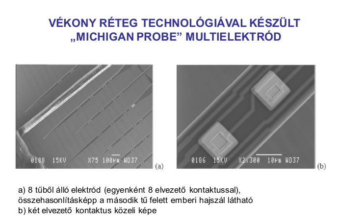

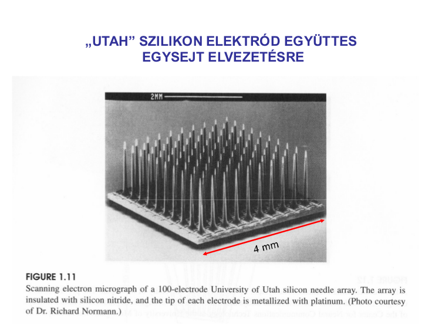

## IONTOFORÉZIS

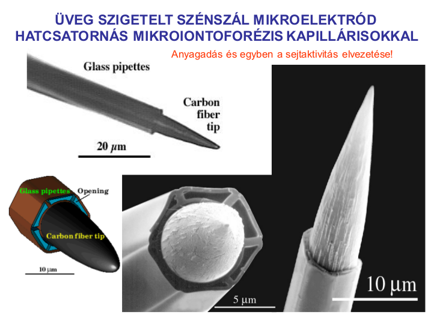

#3. Fém elektródok jellemzői, az elektród potenciál fogalma és jelentősége
***Ideális elektród nincs***
- Intracelluláris mikroelvezetés:
  - üvegkapilláris mikroelektród (patch-clamp elektród)
  - ***Sharp*** microelectrode
    - Nagy elektróda ellenállás
    - Szivárgó áram, kis szigetelő ellenállás (50-100 MOhm)
    - hegy (0.06-0.3 um) << 1 um
    - Current clamp elvezetés
    - Alig befolyásolja a citoplazmát
    - Sejtszintű áramok vizsgálatára alkalmas (neuronpopuláció aktivitásának függvényében)
  - Elrendezés: Extracell referencia - Intracell aktív
  - **Előnyök-Hátrányok**:
    - - Technikailag bonyolultabb
    - + Nagy  jel amplitúdója (1-100 mV)
    - - Kevés csatornán (1-4) lehet elvezetni
    - - Szabadon mozgó állatokban nem használható
    - + Sejten belüli folyamatot közvetlenül méri

- Extracelluláris mikroelvezetés:
  - üvegkapilláris mikroelektród
  - hegyezett fém elektród, lakk szigetelés
  - hegyezett fém elektród, üveg szigetelés
  - szénszál, üveg kapilláris szigetelés
  - szigetelt vékony fémhuzal (fine wire electrode)
  - tetród
  - multielektród
  - **Előnyök-Hátrányok**:
    - + Technikailag egyszerűbb
    - - Alacsony jel amplitdúdó (10-500 uV)
    - - Kis elektromos zajú erősítők kellenek
    - + Sok csatornán (10-200) lehet elvezetni
    - + Szabadon mozgó állatokban is használható
    - - Sejten belüli folyamatokat közvetlenül nem méri

## Elektród típusok (Agyi bioelektromos jelekhez)
  ***Ideális elektród nincs***
  - Intracelluláris mikroelvezetés:
    - üvegkapilláris mikroelektród (patch-clamp elektród)
      - Kis elektróda ellenállás
      - Nagy szigetelési ellenállás (5 GOhm)
      - hegy < 1 um
    - Sharp microelectrode
      - Nagy elektróda ellenállás
      - Szivárgó áram, kis szigetelő ellenállás (50-100 MOhm)
      - hegy (0.06-0.3 um) << 1 um
    - - Technikailag bonyolultabb
    - + Nagy  jel amplitúdója (1-100 mV)
    - - Kevés csatornán (1-4) lehet elvezetni
    - - Szabadon mozgó állatokban nem használható
    - + Sejten belüli folyamatot közvetlenül méri

  - Extracelluláris mikroelvezetés:
    - üvegkapilláris mikroelektród
    - hegyezett fém elektród, lakk szigetelés
    - hegyezett fém elektród, üveg szigetelés
    - szénszál, üveg kapilláris szigetelés
    - szigetelt vékony fémhuzal (fine wire electrode)
    - tetród
    - multielektród
    - + Technikailag egyszerűbb
    - - Alacsony jel amplitdúdó (10-500 uV)
    - - Kis elektromos zajú erősítők kellenek
    - + Sok csatornán (10-200) lehet elvezetni
    - + Szabadon mozgó állatokban is használható
    - - Sejten belüli folyamatokat közvetlenül nem méri
  - Lokális mezőpotenciál elvezetés (LocalFieldPotential - LFP):
    - Fentiek bármelyike
  - Makropotenciál elvezetés:
    - Felszíni elvezetés:
      - fém korong elektród
      - Ag/AgCl elektród
    - Intracerebelláris/muszkuláris:
      - szigetelt fémhuzal elektród
      - multielektród
      - tű elektród

## Tartományok
  - Scalp - 2-10mm - 10-200 uV
  - Epidural - 1-3mm - 0.1-4 mV
  - Surface (Brain) - 1-3 mm - 0.2-5 mV
  - Extracellular - 1-50 um - 0.4-20 mV
  - Intracellular - 0.5-3 um - 1-100 mV

## Elektródok általános tulajdonságai
  1. Elektród impedancia
  2. Elektród potenciál
  3. Elektród stabilitás, biokompatibilitás

  ***NEMZETKÖZI EEG SZABVÁNY*** Az elektród ellenállása kevesebb legyen mint 5 kOhm

  Nagyságrendi adatok:
  - **Ellenállás**
    - Réz: 1.7 uOhm cm
    - [3M] KCl: 5 Ohm cm
    - Tengervíz: 22 Ohm cm
    - Fiziológiás oldat: 70 Ohm cm
    - Csapvíz: 0.2-10 Ohm cm
    - Desztillált víz: 1-5 MOhm cm
  - **Neuron**
    - R-membrán: 10-100 kOhm cm^2
    - R-20 um átmérőjű neuron: ~200 MOhm
    - C-memberán: 1 uF/cm^2
    - C-20 um átmérőjű neuron: ~50 pF
    - R-intracelluláris térben: 50-200 Ohm cm
  - **Mikroelektród**
    - SHARP - Alacsony szigetelési ellenállás (50-100 MOhm) - szivárgási áram
    - Patch-Clamp (negatív nyomás után) - Nagy szigetelési ellenállás (50 GOhm)

## Elektród impedancia helyettesítő áramköre
*Elektród bemenő impedanciája méretétől és anyagától függ*

## Bipoláris elvezetés helyettesítő áramköre

A két mérőelektród tulajdonságai lehetőleg azonosak legyenek!

## Mikroelektród elvezetés helyettesítő áramköre

## Elektrokémiai feszültségsor

***Fém-folyadék-fém kapcsolat esetén az elektrokémiai feszültségsornak megfelelő galvánelem képződik.***
  - Elektrokémiai feszültségsor: Fémelektróda és fémsó oldat közötti feszültség egy különleges elrendezésben mérhető. E célre úgynevezett hidrogénelektródát használnak, ehhez rendelik a 0 V vonatkoztatási potenciált.
  A táblázatban a fémek szabványosan mért feszültségértékei láthatóak.
  Az elektrokémiai feszültségsor segítségével különböző elektróda-anyag kombinációk várható feszültsége határozható meg.
  **Azokat a fémeket, amelyek a hidrogénhez képest pozitív feszültségűek, nemesfémeknek, míg a többieket nem-nemes (másnéven közönséges) fémeknek nevezzük.**
  Két fém összehasonlításakor a feszültségsorban nagyobb értékkel rendelkező fémet a másiknál "nemesebbnek" hívjuk.
  - PL: nemes - Arany, közönséges-Magnézium

## Rozsda keletkezése, elektród stabilitása

4. A sejtaktivitás befolyásolása iontoforézissel
5. A membránpotenciál létrejöttéért felelős folyamatok
6. Az akciós potenciál létrejöttéért felelős folyamatok
7. Az intracelluláris elvezetési módszerek

- Intracelluláris mikroelvezetés:
  - üvegkapilláris mikroelektród (***patch-clamp*** elektród)
    - Kis elektróda ellenállás
    - Nagy szigetelési ellenállás (5 GOhm)
    - hegy < 1 um
  - ***Sharp*** microelectrode
    - Nagy elektróda ellenállás
    - Szivárgó áram, kis szigetelő ellenállás (50-100 MOhm)
    - hegy (0.06-0.3 um) << 1 um
    - Current clamp elvezetés
    - Alig befolyásolja a citoplazmát
    - Sejtszintű áramok vizsgálatára alkalmas (neuronpopuláció aktivitásának függvényében)
  - Elrendezés: Extracell referencia - Intracell aktív
  - **Előnyök-Hátrányok**:
    - - Technikailag bonyolultabb
    - + Nagy  jel amplitúdója (1-100 mV)
    - - Kevés csatornán (1-4) lehet elvezetni
    - - Szabadon mozgó állatokban nem használható
    - + Sejten belüli folyamatot közvetlenül méri

- Extracelluláris mikroelvezetés:
  - **Előnyök-Hátrányok**:
    - + Technikailag egyszerűbb
    - - Alacsony jel amplitdúdó (10-500 uV)
    - - Kis elektromos zajú erősítők kellenek
    - + Sok csatornán (10-200) lehet elvezetni
    - + Szabadon mozgó állatokban is használható
    - - Sejten belüli folyamatokat közvetlenül nem méri

8. Extracelluláris mikroelektród elvezetés, sejtazonosítás
9. A biológiai előerősítők jellemző tulajdonságai
# 10. Stereotaxiás módszer

## Wikipedia
*Stereotactic surgery or stereotaxy is a minimally invasive form of surgical intervention which makes use of a three-dimensional coordinate system to locate small targets inside the body and to perform on them some action such as ablation, biopsy, lesion, injection, stimulation, implantation, radiosurgery (SRS), etc.

In theory, any organ system inside the body can be subjected to stereotactic surgery. However, difficulties in setting up a reliable frame of reference (such as bone landmarks which bear a constant spatial relation to soft tissues) mean that its applications have been, traditionally and until recently, limited to brain surgery. Besides the brain, biopsy and surgery of the breast are done routinely to locate, sample (biopsy) and remove tissue. Plain X-ray images (radiographic mammography), computed tomography, and magnetic resonance imaging can be used to guide the procedure.*

  - KOPF model 1404:
    - Electrode holder
    - Electrode manipulator
    - Eye bar
    - Ear bar
    - Stereotaxic frame

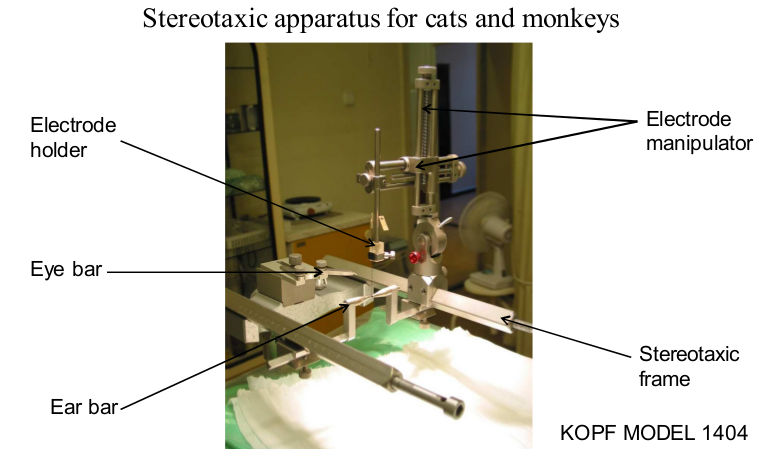

  - KOPF model 902:
    - 1404 + Nose and tooth bar assembly

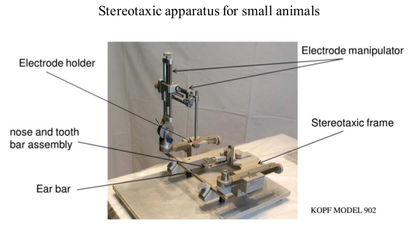

# 11. Az EEG elvezetés technikája

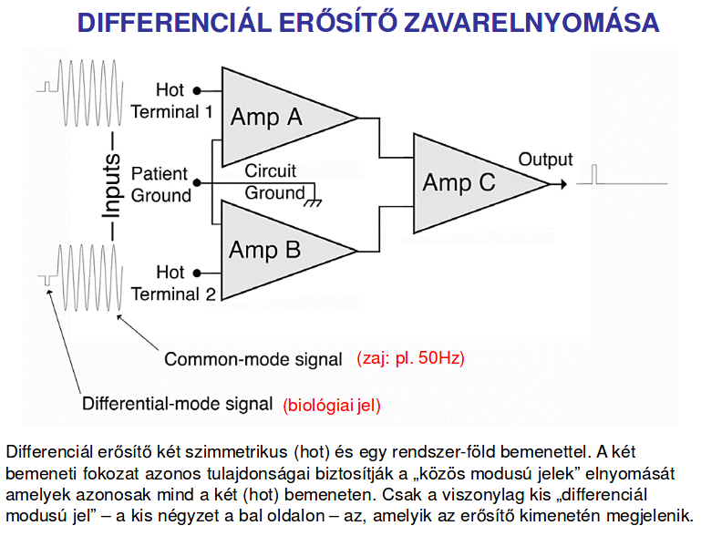

## Az EEG elektródok elnevezése

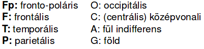
## Ag/AgCl ragasztós elektródok

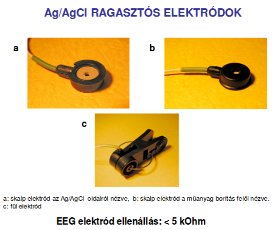
## Elvezetés típusai
Elvezetések felhelyezésének módja: -montázs-

  - MINDIG 1 FÖLD
  - Monopoláris: 1 indifferens (referens), a többi aktív (csak egy elektród van aktív szövetben/-en a másik, indifferens/0 potenciálú helyen van)
  - Bipoláris: Ami az egyiknek referens a másiknak aktív (mindkét elektród aktív felületen van, vagy a szövetben helyezkedik el)
  - Közös átlag indifferens: külön aktív elektródok, egy indifferenssel összekötve egy-egy nagy ellenálláson keresztül.
  - Forrás átlag indifferens elvezetés: hasonló az előzőhöz de több indifferens van

# 12. EEG elvezetésnél jelentkező zavarok
## Artefacts:
  - Eye Movements
    - Horizontal/Vertical eye Movements
    - Oblique (ferde) eye Movements
    - "Glass eye" assymetries
    - Eyelid flutter (pislogás, szemrebegtetés vagymi)
    - Nystagmus (szemrángás)
    - Electroretinogram
  - Electrocardiographic Artifacts
    - QRS complexes
    - Extra systoles
    - Pulse Artifacts
    - Pacemaker
    - Arrhytmia
    - Defibrillators
  - Electromyographic Artifacts
    - Lateral rectus
    - Single motor units
    - Frontalis/Occipital/Temporal EMG
    - Swallowing
  - Glossokinetic (nyelvmozgás) Artifacts
  - Galvanic Skin Response
    - Perspiration ( izzadás )
    - Salt bridge
  - Physiological Movements
    - Tremors (görcs, rángás)
    - Hypnic jerks
    - Nocturnal leg movements
  - Instrumental Artifacts
    - Amplifier & electronic components
    - 50/60 Hz zaj
    - Capacitive / inductive / magnetic / electrostatic compunds
  - Electrode Artifacts
    - Electrode Pop
    - Intermittent contact
    - Impedance-related Artifacts
    - Electrolytes
    - Electrode movement/placement
  - Environmental Artifacts
    - Radiofrequency signals
    - Line isolation scanners (?)
    - Bipolar coagulators
    - Impedance mismatches
    - Electrostatic field
  - Digital Artifacts
    - DC offset
    - Aliasing
  - Multiplexing Artifacts

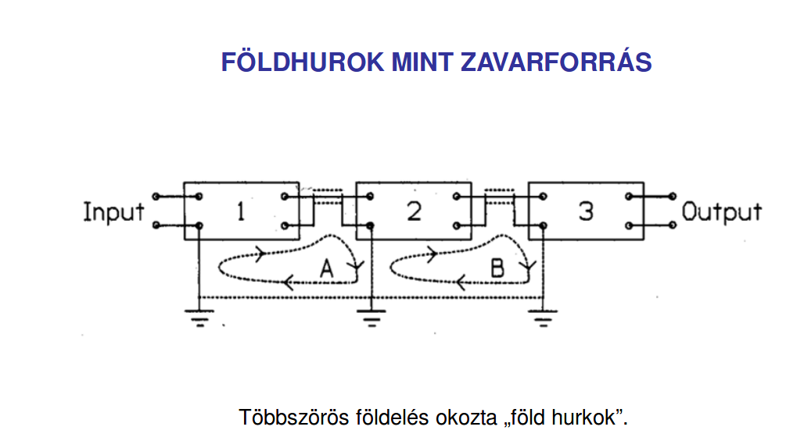

# 13. Az EEG jellemző összetevői, kóros EEG jelek
## Spontán EEG összetevői:

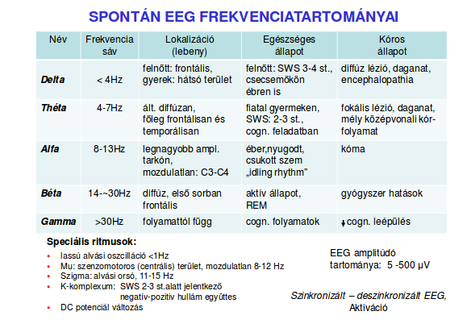

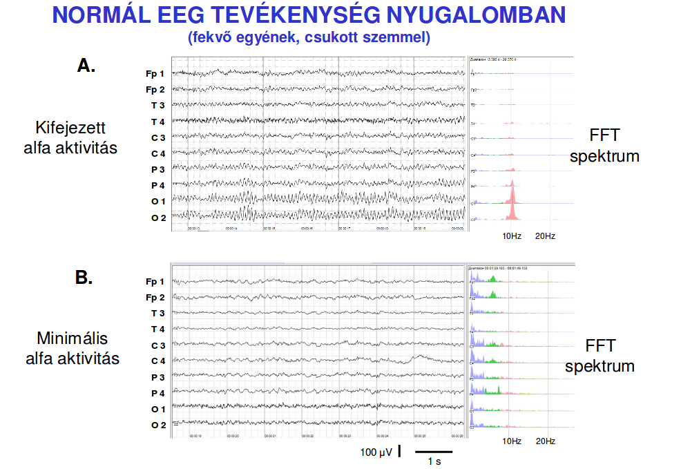

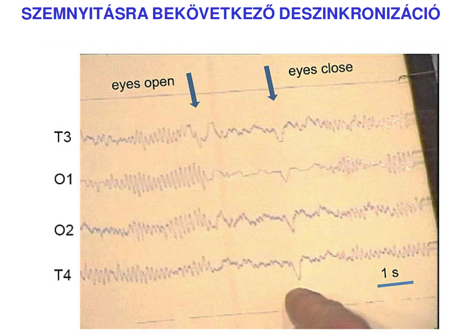

## Éberség függő jelek:
  - Awake: low voltage-random, fast
  - Drowsy: 8-12 Hz Alpha
  - Stage 1: 3-7 Hz Theta
  - Stage 2: 12-14 Hz sleep-spindles (alv. orsók) and K complexes
  - Deep sleep: 0.5-2 Hz delta waves (> 75 uV)
  - REM sleep: low voltage-random, fast sawtooth (fűrész) waves, Ponto-Geniculo-Occular waves (PGO)
## Kóros EEG jelek:
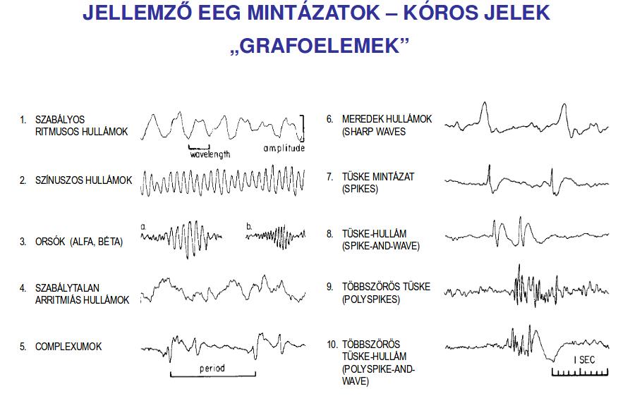
  1 Focal seizures (fokális/részleges roham):
    - Simple Partial seizures (tudatánál van)
      - motor signs
      - sensory symptoms
      - autonomic symp. or sign
      - psychic
    - Complex Partial seizures (eszméletvesztéssel)
      - partial onset, followed by impairment of consciousness
      - IoC on the beginning
    - Partial seizures evolving to complex partial -> generalized seizures
    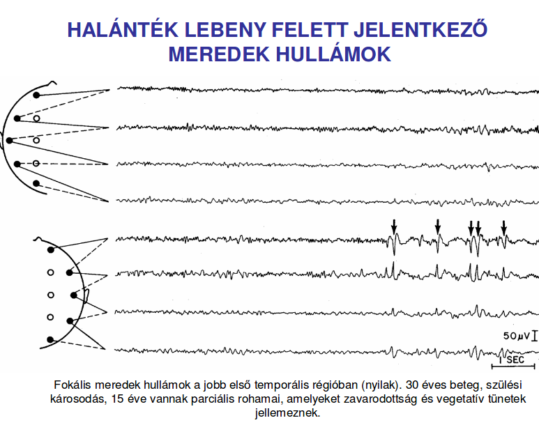
  2 Generalized seizures:
    - Absence seizures (petit mal) - 3Hz tüske hullám
    - Myoclonic
    - Clonic
    - Tonic
    - Tonic-Clonic (grand mal)
    - Atonic (akinetic)

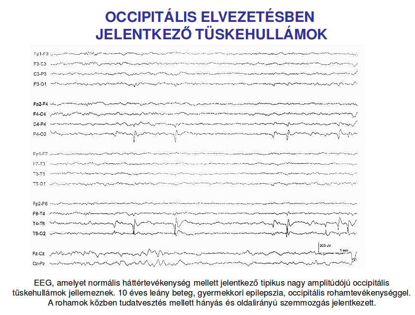

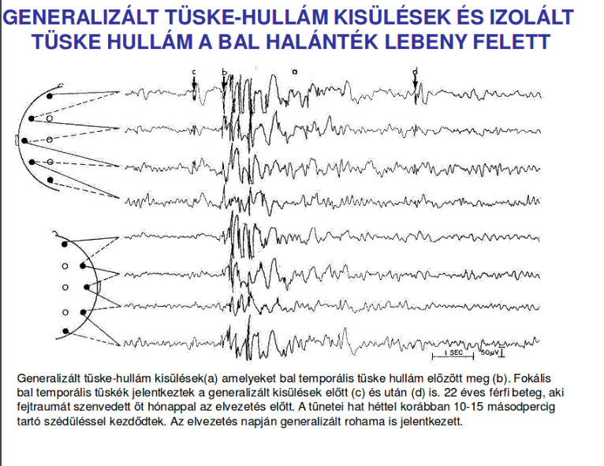

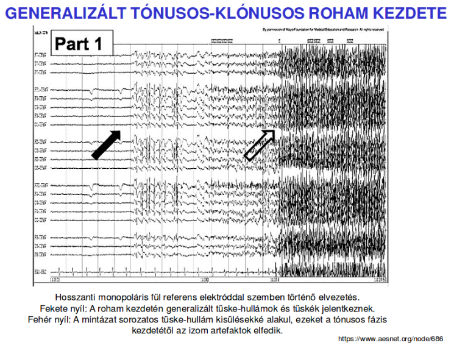

### Aktivációs módszerek
  - Visual Stimulation
    - Visual exploration
    - Stroboscopic flash
    - Pattern
    - TV
    - Eye closure
  - Somatosensory Stimulation
    - Tactile (tapintás)
    - Electrical
    - Water immersion (baptism)
  - Auditory Stimulation
    - Nonspecific sounds
    - Music
  - Sleep
    - Pharmacologically induced
    - Spontaneous
    - Sleep deprivation (megvonás)
  - Hyperventilation Pharmacological Agents
    - Anticonvulsant (görcsoldó) medication withdrawal
    - Pentylenetetrazol (& ?photic? stimulation)
    - Bemegride
  - Metabolic Toxicity
    - Hypoglycemia
    - Hypoxia
  - Special Stimuli
    - Startle
    - Reading
    - Writing
    - Mental calculation
    - Mental imagery
    - Eating

# 14. Eseményhez-kötött potenciálok (exogén, endogén komponensek)
**Event related potential** (ERP) - Valamely diszkrét eseményre való felkészüléskor, külső inger vagy belső tényező hatására kialakuló, az eseményhez időben kötött, több hullámból álló agyi potenciál oszcilláció.

**Evoked potential** (EP) - EKP egy altípusa, szenzoros inger hatására létrejövő, ehez időben kötött, több hullámból álló agyi potenciál oszcilláció

## ERP osztályozása:
  - Szenzoros
  - Motoros
  - Eseményhez-kötött (De-)szinkronizáció
  - Indukált válasz

## ERP-k jellemzése:
  - Polaritás
  - Amplitúdó
  - latencia (csúcs, onset)
  - lokalizáció (a skalpon)
  - invariancia (kísérleti változók iránti érzékenység)

## ERP Komponenseinek osztályozása:
  - Latenciájuk szerint
    - Korai (10 ms - 0.2 uV)
    - Közép (50 ms - 0.4 uV)
    - Késői (500 ms - 4.0 uV)
  - Kiváltó hatás jellege szerint
    - Exogén
    - Endogén

## Komponens definíciója:
Szigorúbb nyelvhasználatban a komponens egy adott forrás által generált
ERP-t jelent

### Összefüggés:
  Korai - Exogén
  (Közép - Mezogén)
  Késői - Endogén

## Az átlagolás SNR javítása
A vizsgálni kívánt EKP amplitúdója rendszerint jóval kisebb mint a háttér EEG.
**A MÓDSZER ALAPFELTEVÉSEI**
- jel(t) = EEG(t) + EKP(t)
- cov(EEG(t), EKP(t)) = 0  - *függetlenek*

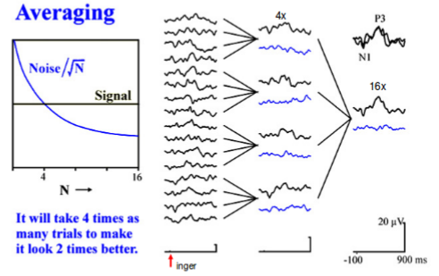

Javítás átlagolással, függvény:
*SNR (N átlaggal)-> 2*SNR (4N átlaggal)*

**Brainstem Auditory Evoked Potential** (BAEP)
**Brainstem Evoked Response Audimetry** (BERA)

## Oddball Paradigma:
- **Aktív**: Számolja a deviáns (P300 jellmező)
- **Passzív**: Nem figyel az ingerekre (MMN jellemző) - Eltérési negativitás (Mismatch Negativity - MMN) a kimutatás eszköze

## Komponensek
  - P300 - (370-390ms az inger után, ~-10 uV)- (Emanuel Donchin) - *Szenzoros információ feldolgozásának befelyezését jelenti*, a feladat nehézségével arányosan növekszik a P300 latenciája is
  - N1 - (100-120ms, ~+8uV)- (Steven A. Hillyard) Szelektív figyelmi hatás:
*A standard és deviáns ingereket véletlenszerűen hol a jobb, hol a bal fülbe adják.
A kísérleti személy feladata az, hogy figyelje és számolja az egyik fülbe érkező
deviáns ingereket. Elemzik, hogy milyenek a standard ingerekkel kiváltott
válaszok. A „figyelt” fülbe érkező hangingerek által kiváltott válaszok N1
komponense nagyobb. A „szelektív figyelem” eredményképpen a „figyelt bemenet”
érzékenysége fokozott.*
  - Error Related Negativity (ERN) - (50-150ms a téves válasz után) generátora a gyrus cynguli anterior területén. (Stroop hatás, különböző színnel vannak leírva a színek nevei -> a felolvasás könnyebb mint a szín megmondása)
  - P150 - nagy a szöveg szerű ingerre (words, pseudowords, pseudofont) kicsi az tárgy szerű ingerre (objects and pseudoobjects) és közepes a pici objektumok sorozatára (Central Cz and Occipital Oz electrode site/zone-on mért eredmények átlaga)
  - N400 (Kutas Márta -10 uV, szavanként mérhető, Pz electrode) *Szemantikai anomália*: olvasott szöveg esetén az oda nem illő szavaknál lehet erre felfigyelni
  - P560 (~12-25uV, William Grey Walter) Fizikai eltérés
  - Contingent Negative Variation (CNV), várakozási hullám a kettő között:
    - S1: figyelmeztető inger (hang)
    - S2: feladatjelző inger (fény)
    - Feladat: S1 jelzi a feladat kezdetét, S2-t minél hamarabb megszakíteni egy gombnyomással.
    - Eredmény: ha S1 és S2 között több idő telik el, a korai és késői CNV szétválik
  - Motors Potenciál (MP) (10 uV) CNV-vel egybefűződik: Felkészülési (Bereitschhaft-) potenciál - akaratlagos mozgás előtt jelentkezik

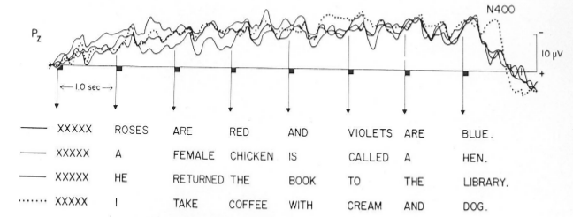

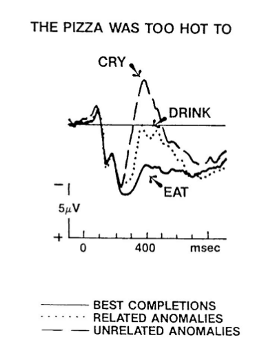

## Brain Mapping:

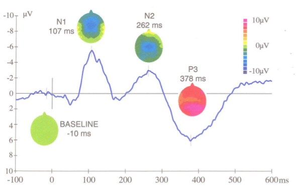

15. EEG-ERP számítógépes analízisének főbb módszerei
16. EEG genezis, bioelektromos mezők típusai
17. ERP forrás-analízis jelentősége
# 18. „Steady state” válasz, klinikai alkalmazása
## Steady State Response (SSR):
*Repetitív akusztikus ingerlésnél kb. 40Hz ingergyakoriságnál viszonylag nagy amplitúdójú szinuszoid hullám-alakú ritmikus válasz jelentkezik.*
## Klinikai alkalmazás - Hallásküszöb meghatározás
Acoustic Steady State Response (ASSR)
  - Objektív audiometria
    - csecsemő
    - kognitív károsodott
    - funkcionális hallászavar
  - Narkózis monitorozás (altatás - a szükségesnél NEM kell mélyebben altatni)
    - Szenzoros funkció
    - Narkózis mélysége
  - Neurológiai vizsgálat
    - Centrális akusztikus károsodás
    - Specifikus neurológiai kórképek
  - Terence W. Picton
  - Sasha John

## Hanggal kiváltott ASSR (0.2 uV)
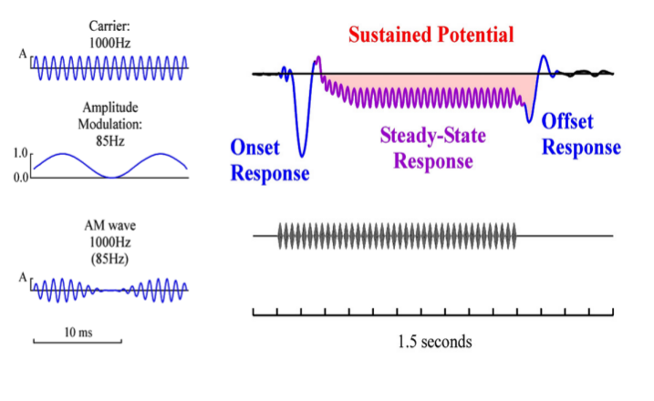

## Több inger egyszerre (BRAIN alatt ASSR frekvenciatartomány van)
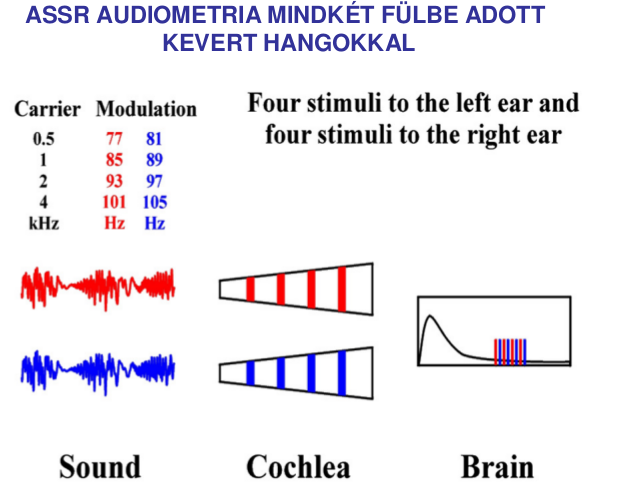
  - Eszköz a mérésre: MASTER és Aurix

19. Magnetoenkefalográfia
20. Elektromiográfia
21. EKG elvezetések típusai, az EKG görbe jellemzői
22. Az EKG kóros eltérései
