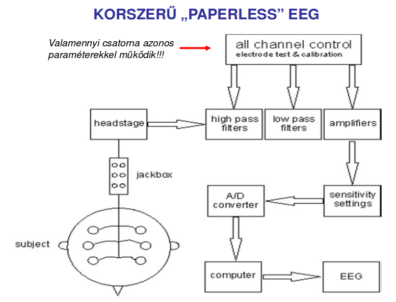
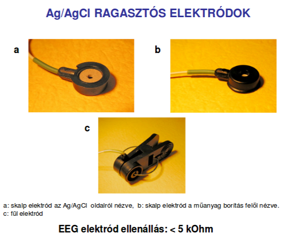
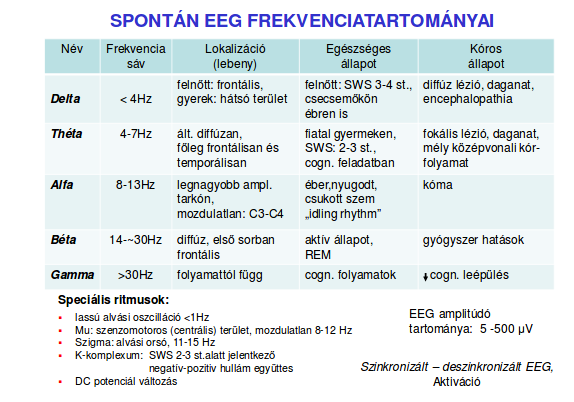
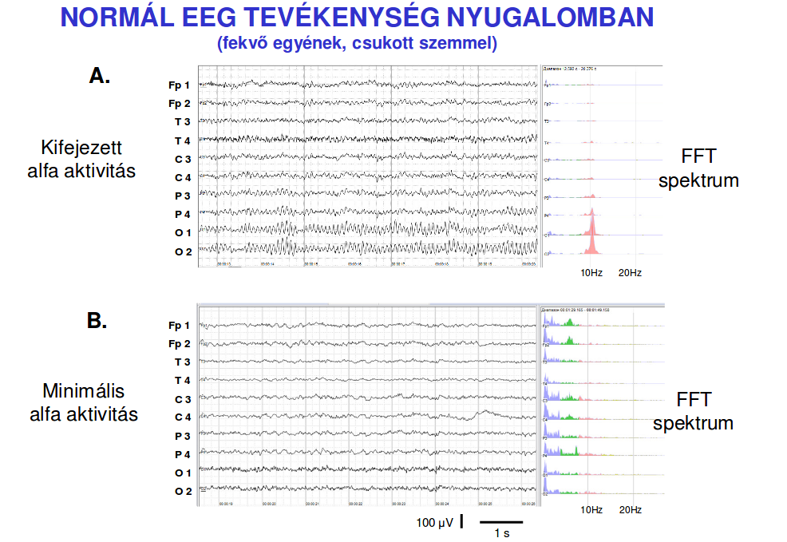
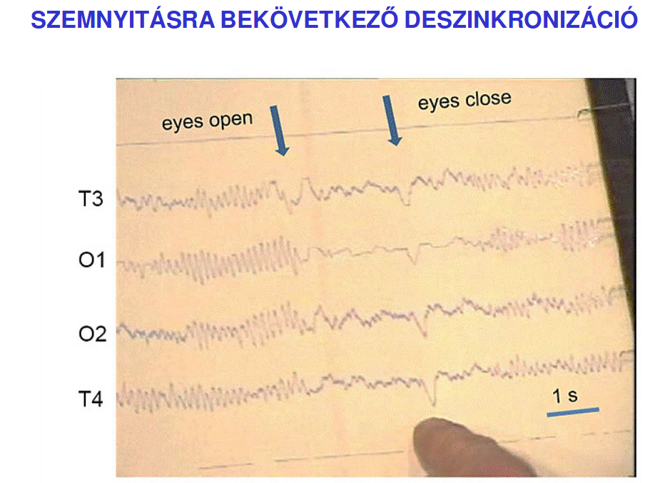
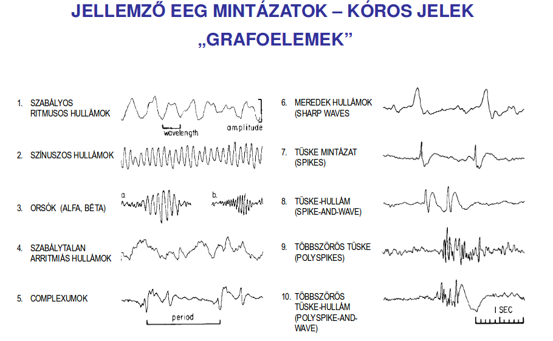

# 1. Bioelektromos jelek osztályozása, vizsgálómódszerek
## Osztályozás
### Nagyságrend szerint:
  - Micro
    - Membrán potenciál (MP)
    - Akciós potenciál  (AP)
    - Idegsejt aktivitás
      - intra/extra/multi- unit aktivitás (I/E/M - UA)

  - Macro
    - Neurogram (Electro - NG)
    - Retinogram (ERG)
    - Enkefalogram (EEG)
    - Kortikogram (ECoG)
    - Magnetoenkefalogram (MEG)
    - Event-related Potential (ERP)
      - Evoked Potential (EP)
      - Visual EP
      - Auditory EP
      - Somatosensory EP

  - Határon: Local Field Potential (LFP)

### Mérés helye szerint
  - --agy-- Kortiko-, Enkefalo-
  - --szív-- Cardiac-
  - --egyéb izom-- Myo-

## Vizsgálómódszerek
  - --ElektroOkulokGram-- (EOG):

A szem elektromosan töltött gömb, pozitív pólusa elöl, negatív hátul van.
Szemmozgáskor ez az elektromos dipól iránya változik, a szem köré helyezett
elektródokkal potenciálváltozásként elvezethető.

  - --Pszichofiziológia--:

  Pszichológiai folyamatokhoz társuló elektrofiziológiai változókat vizsgálja.

    - Független változó: pszichológiai,
    - Függő változó: fiziológiai

    - Szisztémás pszichofiziológia:
      - központi idegrendszeri változók
      - szív - érrendszeri változók

    - Tematikus pszichofiziológia:
      - kognitiv-
      - fejlődés-
      - szociál-
      - klinikai-

2. A biopotenciál elvezető elektródok jellemző tulajdonságai (impedancia, frekvencia átvitel)
3. Fém elektródok jellemzői, az elektród potenciál fogalma és jelentősége
4. A sejtaktivitás befolyásolása iontoforézissel
5. A membránpotenciál létrejöttéért felelős folyamatok
6. Az akciós potenciál létrejöttéért felelős folyamatok
7. Az intracelluláris elvezetési módszerek
8. Extracelluláris mikroelektród elvezetés, sejtazonosítás
9. A biológiai előerősítők jellemző tulajdonságai
10. Stereotaxiás módszer
# 11. Az EEG elvezetés technikája

## Az EEG elektródok elnevezése

## Ag/AgCl ragasztós elektródok

## Elvezetés típusai
Elvezetések felhelyezésének módja: -montázs-

  - MINDIG 1 FÖLD
  - Monopoláris: 1 indifferens (referens), a többi aktív
  - Bipoláris: Ami az egyiknek referens a másiknak aktív
  - Közös átlag indifferens: külön aktív elektródok, egy indifferenssel összekötve egy-egy nagy ellenálláson keresztül.
  - Forrás átlag indifferens elvezetés: hasonló az előzőhöz de több indifferens van

# 12. EEG elvezetésnél jelentkező zavarok
## Artefacts:
  - Eye Movements
    - Horizontal/Vertical eye Movements
    - Oblique (ferde) eye Movements
    - "Glass eye" assymetries
    - Eyelid flutter (pislogás, szemrebegtetés vagymi)
    - Nystagmus (szemrángás)
    - Electroretinogram
  - Electrocardiographic Artifacts
    - QRS complexes
    - Extra systoles
    - Pulse Artifacts
    - Pacemaker
    - Arrhytmia
    - Defibrillators
  - Electromyographic Artifacts
    - Lateral rectus
    - Single motor units
    - Frontalis/Occipital/Temporal EMG
    - Swallowing
  - Glossokinetic (nyelvmozgás) Artifacts
  - Galvanic Skin Response
    - Perspiration ( izzadás )
    - Salt bridge
  - Physiological Movements
    - Tremors (görcs, rángás)
    - Hypnic jerks
    - Nocturnal leg movements
  - Instrumental Artifacts
    - Amplifier & electronic components
    - 50/60 Hz zaj
    - Capacitive / inductive / magnetic / electrostatic compunds
  - Electrode Artifacts
    - Electrode Pop
    - Intermittent contact
    - Impedance-related Artifacts
    - Electrolytes
    - Electrode movement/placement
  - Environmental Artifacts
    - Radiofrequency signals
    - Line isolation scanners (?)
    - Bipolar coagulators
    - Impedance mismatches
    - Electrostatic field
  - Digital Artifacts
    - DC offset
    - Aliasing
  - Multiplexing Artifacts

# 13. Az EEG jellemző összetevői, kóros EEG jelek
## Spontán EEG összetevői:

## Éberség függő jelek:
  - Awake: low voltage-random, fast
  - Drowsy: 8-12 Hz Alpha
  - Stage 1: 3-7 Hz Theta
  - Stage 2: 12-14 Hz sleep-spindles (alv. orsók) and K complexes
  - Deep sleep: 0.5-2 Hz delta waves (> 75 uV)
  - REM sleep: low voltage-random, fast sawtooth (fűrész) waves, Ponto-Geniculo-Occular waves (PGO)
## Kóros EEG jelek:

  1 Focal seizures (fokális/részleges roham):
    - Simple Partial seizures (tudatánál van)
      - motor signs
      - sensory symptoms
      - autonomic symp. or sign
      - psychic
    - Complex Partial seizures (eszméletvesztéssel)
      - partial onset, followed by impairment of consciousness
      - IoC on the beginning
    - Partial seizures evolving to complex partial -> generalized seizures
    
  2 Generalized seizures:
    - Absence seizures (petit mal) - 3Hz tüske hullám
    - Myoclonic
    - Clonic
    - Tonic
    - Tonic-Clonic (grand mal)
    - Atonic (akinetic)

### Aktivációs módszerek
  - Visual Stimulation
    - Visual exploration
    - Stroboscopic flash
    - Pattern
    - TV
    - Eye closure
  - Somatosensory Stimulation
    - Tactile (tapintás)
    - Electrical
    - Water immersion (baptism)
  - Auditory Stimulation
    - Nonspecific sounds
    - Music
  - Sleep
    - Pharmacologically induced
    - Spontaneous
    - Sleep deprivation (megvonás)
  - Hyperventilation Pharmacological Agents
    - Anticonvulsant (görcsoldó) medication withdrawal
    - Pentylenetetrazol (& ?photic? stimulation)
    - Bemegride
  - Metabolic Toxicity
  - Special Stimuli

14. Eseményhez-kötött potenciálok (exogén, endogén komponensek)
15. EEG-ERP számítógépes analízisének főbb módszerei
16. EEG genezis, bioelektromos mezők típusai
17. ERP forrás-analízis jelentősége
18. „Steady state” válasz, klinikai alkalmazása
19. Magnetoenkefalográfia
20. Elektromiográfia
21. EKG elvezetések típusai, az EKG görbe jellemzői
22. Az EKG kóros eltérései
